# Chapter 3: Building Components Using Swing and JavaFX

## Java Based UI (User Interface)

### Applet

An **applet** is a small Java program that runs within a web browser or an applet viewer. Applets are subclasses of `java.applet.Applet` and are primarily used for creating interactive features on web pages. However, applets are now considered obsolete due to security concerns and lack of browser support. Depricated from JDK 9 and removed from JDK 17.

### AWT (Abstract Window Toolkit)

**AWT** is Java's original platform-dependent windowing, graphics, and user-interface widget toolkit. It provides classes for creating and managing graphical user interface (GUI) components such as windows, buttons, text fields, and event handling. AWT components rely on the underlying native system, which can lead to inconsistencies across platforms. For more advanced and consistent GUIs, Swing and JavaFX are preferred.

### Swing


**Swing** is a part of Java's standard library that provides a rich set of GUI components for building platform-independent desktop applications. Unlike AWT, Swing components are lightweight and written entirely in Java, ensuring consistent behavior across different operating systems. Swing offers advanced features such as pluggable look-and-feel, MVC architecture, and support for complex widgets like tables, trees, and text components. The main class for creating windows in Swing is `javax.swing.JFrame`. Swing remains widely used for desktop application development, though JavaFX is now the preferred choice for modern UIs.

#### Example

```java
package chap03ui;

import javax.swing.*;
import java.awt.*;

public class FrameDemo extends JFrame {
    // Declare components
    JLabel userL, passL;
    JTextField userT, passT;
    JButton loginB;

    FrameDemo() {
        // Initialize components
        userL = new JLabel("Username:");
        passL = new JLabel("Password:");
        userT = new JTextField(20);
        passT = new JTextField(20);
        loginB = new JButton("Login");

        // Add components
        add(userL);
        add(userT);
        add(passL);
        add(passT);
        add(loginB);

        // Define layout
        setLayout(new FlowLayout());
        setSize(400, 400);
        setTitle("Login Frame");
        setDefaultCloseOperation(EXIT_ON_CLOSE);
        setVisible(true);
    }

    public static void main(String[] args) {
        new FrameDemo();
    }
}
```

**Output:**

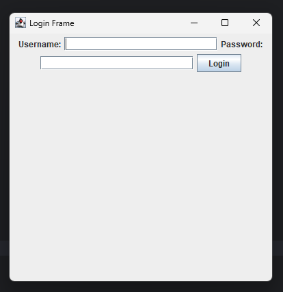

### JavaFX

**JavaFX** is a modern Java library for building rich, visually appealing user interfaces for desktop applications. It provides a wide range of UI controls, CSS styling, animation, and multimedia capabilities. JavaFX applications use a scene graph architecture, where the UI is structured as a hierarchy of nodes. Layouts, controls, shapes, and effects can be combined to create complex interfaces. JavaFX supports FXML, an XML-based language for defining UI layouts, and integrates well with Java code. Since JDK 11, JavaFX is distributed as a separate module from the JDK, allowing for modular application development. JavaFX is the recommended toolkit for new Java desktop applications.

---

## Event Handling

### What is Event Handling?

**Event handling** in Java refers to the mechanism that controls the response to user actions such as clicks, key presses, mouse movements, or other interactions with GUI components. In Java, event handling is based on the **event delegation model**, which separates event generation from event handling.

### Event Delegation Model


- **Event Source:** The component (e.g., button, text field) that generates an event.
- **Event Object:** An instance of a class (like `ActionEvent`, `MouseEvent`) that encapsulates information about the event.
- **Event Listener:** An interface that defines methods to handle specific types of events (e.g., `ActionListener`, `MouseListener`). Listeners are registered with event sources.

### Example: Handling Button Click in Swing

```java
JButton button = new JButton("Click Me");
button.addActionListener(new ActionListener() {
    public void actionPerformed(ActionEvent e) {
        System.out.println("Button was clicked!");
    }
});
```

In this example, when the button is clicked, the `actionPerformed` method is called, and the message is printed.

### ActionListener Interface

The `ActionListener` interface is a part of the `java.awt.event` package and is used for receiving action events, such as button clicks. It contains a single method, `actionPerformed(ActionEvent e)`, which must be implemented to define the action to be performed when an event occurs. Components like `JButton`, `JMenuItem`, and others generate action events and allow you to register an `ActionListener` to handle these events. Implementing this interface enables you to specify custom behavior in response to user interactions.

**Example:**
```java
button.addActionListener(new ActionListener() {
    public void actionPerformed(ActionEvent e) {
        // Handle button click
    }
});
```

**Program:**
```java
package chap03ui;

import javax.swing.*;
import java.awt.*;
import java.awt.event.*;

public class FrameDemoActionListener extends JFrame implements ActionListener {
    // Declare components
    JLabel userL, passL;
    JTextField userT, passT;
    JButton loginB;

    FrameDemoActionListener() {
        // Initialize components
        userL = new JLabel("Username:");
        passL = new JLabel("Password:");
        userT = new JTextField(20);
        passT = new JTextField(20);
        loginB = new JButton("Login");

        // Add ActionListener to login button
        loginB.addActionListener(this);

        // Add components
        add(userL);
        add(userT);
        add(passL);
        add(passT);
        add(loginB);

        // Define layout
        setLayout(new FlowLayout());
        setSize(400, 400);
        setTitle("Login Frame");
        setDefaultCloseOperation(EXIT_ON_CLOSE);
        setVisible(true);
    }

    // Override the ActionListener method -> Compulsory
    @Override
    public void actionPerformed(ActionEvent e) {
        String name = userT.getText();
        String passwd = passT.getText();

        if(name.equals("Test") && passwd.equals("Test")) {
            JOptionPane.showMessageDialog(this, "Login success!");
        } else {
            JOptionPane.showMessageDialog(this, "Invalid");
        }
    }

    public static void main(String[] args) {
        new FrameDemoActionListener();
    }
}
```

**Output:**

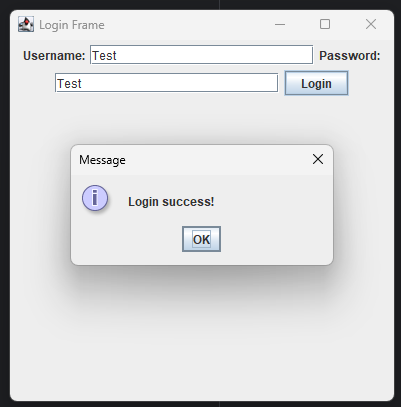

### Key Points

- Java provides various listener interfaces for different event types.
- You must register a listener with a component to handle its events.
- Event handling is essential for interactive GUI applications.
- Both Swing and JavaFX use event-driven programming models, though JavaFX uses lambda expressions and property bindings for more concise code.

---

## JRadioButton in Swing

A **JRadioButton** is a Swing component that represents a radio button, allowing the user to select one option from a group of choices. Radio buttons are typically used in groups, where only one button in the group can be selected at a time. To group radio buttons, use the `ButtonGroup` class.

### Key Points

- Use `JRadioButton` to create individual radio buttons.
- Use `ButtonGroup` to ensure only one button in the group is selected.
- You can add action listeners to handle selection events.

### Example: Using JRadioButton

```java
package chap03ui;

import javax.swing.*;
import java.awt.*;
import java.awt.event.*;

public class RadioButtonDemo extends JFrame implements ActionListener {
    JRadioButton male, female, other;
    JButton submit;

    RadioButtonDemo() {
        setTitle("JRadioButton Example");
        setSize(500, 500);
        setDefaultCloseOperation(EXIT_ON_CLOSE);
        setLayout(new FlowLayout());

        male = new JRadioButton("Male");
        female = new JRadioButton("Female");
        other = new JRadioButton("Other");

        // Group the radio buttons
        ButtonGroup bg = new ButtonGroup();
        bg.add(male);
        bg.add(female);
        bg.add(other);

        submit = new JButton("Submit");
        submit.addActionListener(this);

        add(male);
        add(female);
        add(other);
        add(submit);

        setVisible(true);
    }

    @Override
    public void actionPerformed(ActionEvent e) {
        String msg = "Selected: ";
        if (male.isSelected()) msg += "Male";
        else if (female.isSelected()) msg += "Female";
        else if (other.isSelected()) msg += "Other";
        else msg += "None";
        JOptionPane.showMessageDialog(this, msg);
    }

    public static void main(String[] args) {
        new RadioButtonDemo();
    }
}
```

**Output:**

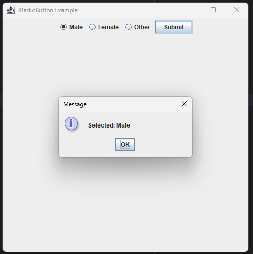

**Note:**  
Radio buttons are ideal for mutually exclusive choices in forms and dialogs.

---

## JCheckBox in Swing

A **JCheckBox** is a Swing component that represents a checkbox, allowing users to make a binary choice (checked or unchecked). Unlike radio buttons, multiple checkboxes in a group can be selected at the same time, making them ideal for options where more than one selection is allowed.

### Key Points

- Use `JCheckBox` to create checkboxes for multiple selections.
- You can add action listeners to handle state changes.
- The `isSelected()` method checks whether a checkbox is selected.

### Example: Using JCheckBox

```java
package chap03ui;

import javax.swing.*;
import java.awt.*;
import java.awt.event.*;

public class CheckBoxDemo extends JFrame implements ActionListener {
    JCheckBox java, python, cpp;
    JButton submit;

    CheckBoxDemo() {
        setTitle("JCheckBox Example");
        setSize(400, 400);
        setDefaultCloseOperation(EXIT_ON_CLOSE);
        setLayout(new FlowLayout());

        java = new JCheckBox("Java");
        python = new JCheckBox("Python");
        cpp = new JCheckBox("C++");

        submit = new JButton("Submit");
        submit.addActionListener(this);

        add(java);
        add(python);
        add(cpp);
        add(submit);

        setVisible(true);
    }

    @Override
    public void actionPerformed(ActionEvent e) {
        String msg = "Selected: ";
        if (java.isSelected()) msg += "Java ";
        if (python.isSelected()) msg += "Python ";
        if (cpp.isSelected()) msg += "C++ ";
        if (!java.isSelected() && !python.isSelected() && !cpp.isSelected()) msg += "None";
        JOptionPane.showMessageDialog(this, msg);
    }

    public static void main(String[] args) {
        new CheckBoxDemo();
    }
}
```

**Output:**

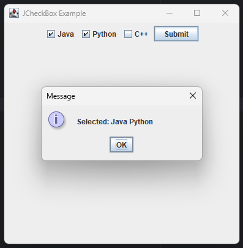

**Note:**  
Check boxes are useful for settings, preferences, and forms where users can select multiple options independently.

---

## JComboBox in Swing

A **JComboBox** is a Swing component that provides a drop-down list of items for users to choose from. It combines the features of a text field and a list, allowing users to either select an item from the list or enter their own value (if editable). JComboBox is useful for presenting a set of options in a compact form.

### Key Points

- Use `JComboBox` to create drop-down lists.
- Items can be added using the constructor or the `addItem()` method.
- You can retrieve the selected item with `getSelectedItem()`.
- Action listeners can be added to handle selection changes.

### Example: Using JComboBox

```java
package chap03ui;

import javax.swing.*;
import java.awt.*;
import java.awt.event.*;

public class ComboBoxDemo extends JFrame implements ActionListener {
    JComboBox<String> languageBox;
    JButton showButton;

    ComboBoxDemo() {
        setTitle("JComboBox Example");
        setSize(400, 400);
        setDefaultCloseOperation(EXIT_ON_CLOSE);
        setLayout(new FlowLayout());

        String[] languages = {"Java", "Python", "C++", "JavaScript"};
        languageBox = new JComboBox<>(languages);

        showButton = new JButton("Show Selected");
        showButton.addActionListener(this);

        add(languageBox);
        add(showButton);

        setVisible(true);
    }

    @Override
    public void actionPerformed(ActionEvent e) {
        String selected = (String) languageBox.getSelectedItem();
        JOptionPane.showMessageDialog(this, "Selected: " + selected);
    }

    public static void main(String[] args) {
        new ComboBoxDemo();
    }
}
```

**Output:**

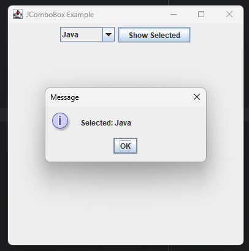

**Note:**  
JComboBox is ideal for situations where you want to save space and present a list of options for the user to select from.

---

## JTextArea in Swing

A **JTextArea** is a multi-line area that displays plain text. It allows users to enter or edit multiple lines of text, making it suitable for tasks like comments, logs, or document editing. Unlike `JTextField`, which is single-line, `JTextArea` supports line wrapping and scrolling.

### Key Points

- Use `JTextArea` for multi-line text input or display.
- You can set the number of rows and columns via the constructor.
- To add scrollbars, wrap the `JTextArea` in a `JScrollPane`.
- Supports methods like `setText()`, `getText()`, and `append()`.

### Example: Using JTextArea

```java
package chap03ui;

import javax.swing.*;
import java.awt.*;
import java.awt.event.*;

public class TextAreaDemo extends JFrame implements ActionListener {
    JTextArea textArea;
    JButton showButton;

    TextAreaDemo() {
        setTitle("JTextArea Example");
        setSize(400, 300);
        setDefaultCloseOperation(EXIT_ON_CLOSE);
        setLayout(new FlowLayout());

        textArea = new JTextArea(8, 30);
        JScrollPane scrollPane = new JScrollPane(textArea);

        showButton = new JButton("Show Text");
        showButton.addActionListener(this);

        add(scrollPane);
        add(showButton);

        setVisible(true);
    }

    @Override
    public void actionPerformed(ActionEvent e) {
        String content = textArea.getText();
        JOptionPane.showMessageDialog(this, "You entered:\n" + content);
    }

    public static void main(String[] args) {
        new TextAreaDemo();
    }
}
```

**Output:**

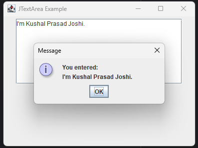

**Note:**  
JTextArea is ideal for collecting or displaying large amounts of text. For better usability, always use it with a scroll pane.

---

## Creating Menus in Swing

Swing provides the `JMenuBar`, `JMenu`, and `JMenuItem` classes to create menus for desktop applications. Menus are typically placed at the top of a window and allow users to perform actions such as opening files, saving, or exiting the application.

### Example: Adding a Menu Bar

```java
package chap03ui;

import javax.swing.*;

public class MenuDemo extends JFrame {
    MenuDemo() {
        // Create menu bar
        JMenuBar menuBar = new JMenuBar();

        // Create menus
        JMenu fileMenu = new JMenu("File");
        JMenu editMenu = new JMenu("Edit");

        // Create menu items
        JMenuItem openItem = new JMenuItem("Open");
        JMenuItem saveItem = new JMenuItem("Save");
        JMenuItem exitItem = new JMenuItem("Exit");

        // Add menu items to File menu
        fileMenu.add(openItem);
        fileMenu.add(saveItem);
        fileMenu.addSeparator();
        fileMenu.add(exitItem);

        // Add menus to menu bar
        menuBar.add(fileMenu);
        menuBar.add(editMenu);

        // Set the menu bar for the frame
        setJMenuBar(menuBar);

        // Add action listener for Exit
        exitItem.addActionListener(e -> System.exit(0));

        setSize(300, 200);
        setTitle("Menu Demo");
        setDefaultCloseOperation(EXIT_ON_CLOSE);
        setVisible(true);
    }

    public static void main(String[] args) {
        new MenuDemo();
    }
}
```

**Output:**

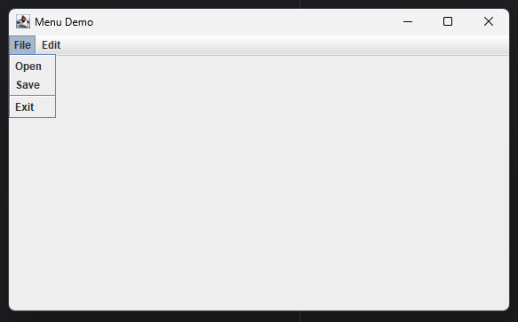

**Note:** Menus enhance usability by organizing commands and actions in a structured way. You can add more menus and items as needed, and attach action listeners to handle user interactions.


### Setting Background Color of a JFrame

You can set the background color of a JFrame by accessing its content pane and using the `setBackground` method. For example:

```java
getContentPane().setBackground(Color.LIGHT_GRAY);
```

#### Example: Setting Background Color

```java
package chap03ui;

import javax.swing.*;
import java.awt.*;

public class FrameWithBackground extends JFrame {
    FrameWithBackground() {
        setTitle("Frame with Background Color");
        setSize(300, 200);
        setDefaultCloseOperation(EXIT_ON_CLOSE);

        // Set background color
        getContentPane().setBackground(Color.CYAN);

        setVisible(true);
    }

    public static void main(String[] args) {
        new FrameWithBackground();
    }
}
```

**Output:**

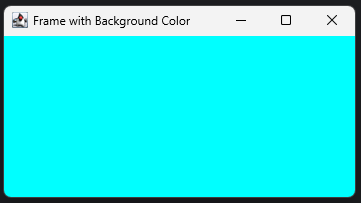


### Example: Menu With Actions

```java
package chap03ui;

import javax.swing.*;
import java.awt.*;
import java.awt.event.*;

public class MenuWIthActions extends JFrame implements ActionListener {
    JMenuBar jmb;
    JMenu col;
    JMenuItem blue, red, green;

    MenuWIthActions() {
        jmb = new JMenuBar();
        col = new JMenu("Color");
        blue = new JMenuItem("BLue");
        red = new JMenuItem("Red");
        green = new JMenuItem("Green");

        col.add(blue);
        col.add(red);
        col.add(green);

        blue.addActionListener(this);
        red.addActionListener(this);
        green.addActionListener(this);

        jmb.add(col);
        setJMenuBar(jmb);

        setSize(400, 400);
        setTitle("Menu Frame");
        setDefaultCloseOperation(EXIT_ON_CLOSE);
        setVisible(true);
    }

    @Override
    public void actionPerformed(ActionEvent e) {
        if (e.getSource() == blue) {
            this.getContentPane().setBackground(Color.BLUE);
        } else if (e.getSource() == red) {
            this.getContentPane().setBackground(Color.RED);
        } else if (e.getSource() == green) {
            this.getContentPane().setBackground(Color.GREEN);
        }
    }

    public static void main(String[] args) {
        new MenuWIthActions();
    }
}
```

**Output:**

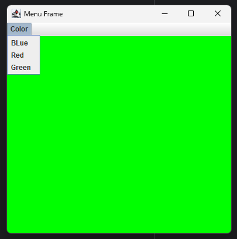

---

## Setting Tool Tip Text of Components

Tool tips provide helpful hints or descriptions when the user hovers the mouse pointer over a component. In Swing, you can set a tool tip for any component by calling the `setToolTipText(String text)` method.

**Example:**

```java
JButton button = new JButton("Hover Me");
button.setToolTipText("Click this button to perform an action");
```

When the user moves the mouse over the button, the specified text will appear in a small pop-up box.

**Key Points:**
- Tool tips enhance user experience by providing contextual information.
- Most Swing components support tool tips.
- Tool tips can be set or changed at runtime.

**Output:**

When hovering over the button, a small pop-up displays:  
`Click this button to perform an action`

---

## Layout Manager in Swing

A **layout manager** in Swing is an object that controls the size and position of components within a container (such as a `JFrame` or `JPanel`). Layout managers automate the arrangement of components, making GUIs flexible and adaptable to different screen sizes and resolutions. Swing provides several built-in layout managers, including `FlowLayout`, `BorderLayout`, `GridLayout`, and others.

### Common Layout Managers

- **FlowLayout:** Arranges components in a left-to-right flow, much like lines of text in a paragraph.
- **BorderLayout:** Divides the container into five regions: North, South, East, West, and Center.
- **GridLayout:** Arranges components in a grid of rows and columns.
- **GridBagLayout:** Provides a flexible and complex way to arrange components in a grid of rows and columns, allowing components to span multiple rows or columns and have different sizes. It is the most powerful and customizable layout manager in Swing, suitable for advanced layouts where precise control is needed.
- **CardLayout:** Allows multiple components (cards) to share the same display space, showing only one at a time. It's useful for implementing wizards, tabbed panes, or step-by-step interfaces where you need to switch between different panels dynamically.
- **BoxLayout:** Arranges components either vertically or horizontally.

### Example: Using FlowLayout

```java
package chap03ui;

import javax.swing.*;
import java.awt.*;

public class FlowLayoutDemo extends JFrame {
    FlowLayoutDemo() {
        setTitle("FlowLayout Example");
        setSize(300, 150);
        setDefaultCloseOperation(EXIT_ON_CLOSE);

        // Set FlowLayout
        setLayout(new FlowLayout());

        // Add components
        add(new JButton("Button 1"));
        add(new JButton("Button 2"));
        add(new JButton("Button 3"));

        setVisible(true);
    }

    public static void main(String[] args) {
        new FlowLayoutDemo();
    }
}
```

**Output:**

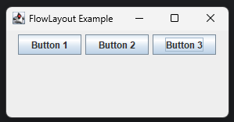

### Example: Using GridLayout

```java
package chap03ui;

import javax.swing.*;
import java.awt.*;
import java.awt.event.ActionEvent;
import java.awt.event.ActionListener;
import java.util.Random;

public class GridLayoutDemo extends JFrame implements ActionListener {
    JButton one, two, three, four;

    GridLayoutDemo() {
        one = new JButton("One");
        two = new JButton("Two");
        three = new JButton("Three");
        four = new JButton("Four");

        one.addActionListener(this);
        two.addActionListener(this);
        three.addActionListener(this);
        four.addActionListener(this);

        setLayout(new GridLayout(2, 2));
        add(one);
        add(two);
        add(three);
        add(four);

        setSize(400, 400);
        setVisible(true);
        setTitle("Grid Layout");
        setDefaultCloseOperation(EXIT_ON_CLOSE);
    }

    @Override
    public void actionPerformed(ActionEvent e) {
        Random random = new Random();
        int number = random.nextInt(5);

        if(e.getSource() == one) {
            if (number == 1) {
                JOptionPane.showMessageDialog(this, "You got it right!");
            } else {
                JOptionPane.showMessageDialog(this, "You got it wrong!");
            }
        }

        if(e.getSource() == two) {
            if (number == 2) {
                JOptionPane.showMessageDialog(this, "You got it right!");
            } else {
                JOptionPane.showMessageDialog(this, "You got it wrong!");
            }
        }

        if(e.getSource() == three) {
            if (number == 3) {
                JOptionPane.showMessageDialog(this, "You got it right!");
            } else {
                JOptionPane.showMessageDialog(this, "You got it wrong!");
            }
        }

        if(e.getSource() == four) {
            if (number == 4) {
                JOptionPane.showMessageDialog(this, "You got it right!");
            } else {
                JOptionPane.showMessageDialog(this, "You got it wrong!");
            }
        }
    }

    public static void main(String[] args) {
        new GridLayoutDemo();
    }
}
```

**Output:**

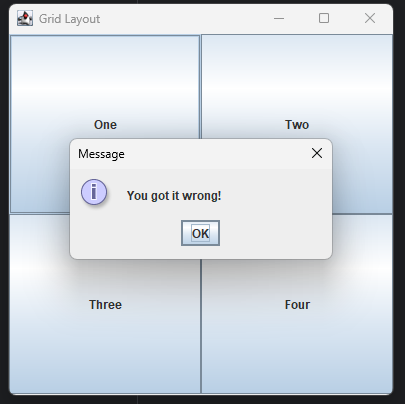

**Note:**  
Choosing the right layout manager is essential for creating user-friendly and responsive GUIs. You can also nest containers with different layout managers for more complex interfaces.

---

## JavaFX

JavaFX is a modern framework for building rich client applications in Java. It provides a powerful set of APIs for creating visually appealing user interfaces with features such as 2D and 3D graphics, animation, audio, video, and web content integration. JavaFX uses a scene graph architecture, where the UI is composed of nodes arranged in a hierarchical structure. Layouts, controls, and effects can be combined to create complex interfaces.


Key features of JavaFX include:
- **Scene-based graphics:** JavaFX uses a scene graph architecture, where the UI is structured as a hierarchy of nodes. This allows for flexible and efficient rendering of complex user interfaces and graphics.
- **FXML:** An XML-based language for defining UI layouts separately from application logic.
- **Animation:** JavaFX provides robust animation APIs for creating smooth transitions, timelines, fades, rotations, scaling, and other visual effects to enhance user experience.
- **CSS Styling:** Allows customization of UI appearance using CSS.
- **Property Bindings:** Enables automatic updates of UI elements when underlying data changes.
- **Rich Controls:** Provides a wide range of built-in controls like buttons, tables, charts, and more.
- **Cross-Platform:** JavaFX applications run on Windows, macOS, and Linux.

Since JDK 11, JavaFX is distributed as a separate module, allowing developers to include only the necessary components in their applications. JavaFX is recommended for new Java desktop projects due to its modern architecture and capabilities.

### Difference Between JavaFX and Swing

| Feature                | Swing                                         | JavaFX                                         |
|------------------------|-----------------------------------------------|------------------------------------------------|
| **Introduction**       | Introduced in 1997 as part of JDK 1.2         | Introduced in 2008 (JavaFX 1.0), modernized in JDK 8+ |
| **Architecture**       | Lightweight components, based on AWT          | Scene graph architecture (hierarchical nodes)   |
| **UI Design**          | Code-based UI design                          | Supports FXML (XML-based UI design)             |
| **Styling**            | Limited support via `UIManager` and Look & Feel | CSS-based styling for flexible customization    |
| **Animation**          | Basic, manual implementation                  | Built-in animation and effects APIs             |
| **Multimedia**         | Limited (basic images, audio)                 | Advanced multimedia (audio, video, web content) |
| **Property Binding**   | Not supported natively                        | Built-in property binding and observables       |
| **3D Graphics**        | Not supported                                 | Supports 2D and 3D graphics                    |
| **Threading Model**    | Single-threaded (Event Dispatch Thread)       | JavaFX Application Thread, supports concurrency |
| **Deployment**         | Bundled with JDK (up to JDK 8)                | Separate modules since JDK 11                   |
| **Modern Features**    | Lacks modern UI features                      | Modern UI controls, responsive design           |
| **Recommended For**    | Legacy desktop applications                   | New desktop applications                        |

**Summary:**  
Swing is mature and widely used for legacy applications, but JavaFX offers a more modern, flexible, and feature-rich approach for building new Java desktop applications.

### Example: Simple JavaFX Application

```java
package chap03ui;

import javafx.application.Application;
import javafx.scene.Scene;
import javafx.scene.control.Alert;
import javafx.scene.control.Button;
import javafx.scene.control.TextField;
import javafx.scene.layout.VBox;
import javafx.stage.Stage;

public class JavaFXDemo extends Application {
    @Override
    public void start(Stage primaryStage) {
        TextField nameField = new TextField();
        nameField.setPromptText("Enter your name");

        Button btn = new Button("Say Hello");
        btn.setOnAction(e -> {
            String name = nameField.getText().trim();
            Alert alert = new Alert(Alert.AlertType.INFORMATION);
            if (!name.isEmpty()) {
                alert.setContentText("Hello, " + name + "!");
            } else {
                alert.setContentText("Please enter your name.");
            }
            alert.showAndWait();
        });

        VBox root = new VBox(10, nameField, btn);
        root.setStyle("-fx-padding: 20; -fx-alignment: center;");

        Scene scene = new Scene(root, 300, 200);

        primaryStage.setTitle("JavaFX Hello Name Demo");
        primaryStage.setScene(scene);
        primaryStage.show();
    }

    public static void main(String[] args) {
        launch(args);
    }
}
```

**Output:**

When you run this program, a window appears with a text field and a button labeled "Say Hello". Enter your name in the text field and click the button. An information dialog will pop up displaying "Hello, [your name]!" If the text field is empty, the dialog will prompt you to enter your name.

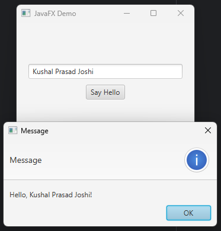

**Note:**  
To run JavaFX applications with JDK 11 or later, ensure the JavaFX libraries are included in your project/module path.

---

## JavaFX Controls: RadioButton, CheckBox, TextArea, ComboBox

JavaFX provides a rich set of UI controls similar to Swing, but with modern features and styling. Here are notes and examples for some commonly used controls:

### RadioButton

A **RadioButton** in JavaFX allows users to select one option from a group. To ensure only one button is selected at a time, group them using a `ToggleGroup`.

**Example:**
```java
package chap03ui;

import javafx.application.Application;
import javafx.scene.Scene;
import javafx.scene.control.*;
import javafx.scene.layout.VBox;
import javafx.stage.Stage;

public class RadioButtonDemoFX extends Application {
    @Override
    public void start(Stage stage) {
        RadioButton rb1 = new RadioButton("Option 1");
        RadioButton rb2 = new RadioButton("Option 2");
        RadioButton rb3 = new RadioButton("Option 3");

        ToggleGroup group = new ToggleGroup();
        rb1.setToggleGroup(group);
        rb2.setToggleGroup(group);
        rb3.setToggleGroup(group);

        Button btn = new Button("Show Selected");
        btn.setOnAction(e -> {
            RadioButton selected = (RadioButton) group.getSelectedToggle();
            String msg = (selected != null) ? selected.getText() : "None";
            new Alert(Alert.AlertType.INFORMATION, "Selected: " + msg).showAndWait();
        });

        VBox root = new VBox(10, rb1, rb2, rb3, btn);
        root.setStyle("-fx-padding: 20;");
        stage.setScene(new Scene(root));
        stage.setTitle("JavaFX RadioButton Example");
        stage.show();
    }
    public static void main(String[] args) { launch(args); }
}
```

**Output:**

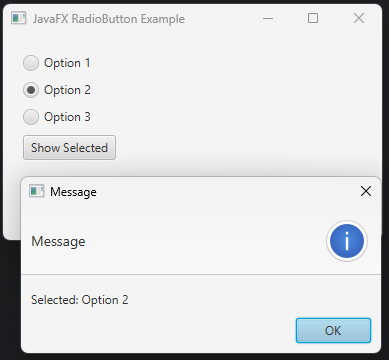

### CheckBox

A **CheckBox** allows users to select or deselect multiple independent options.

**Example:**
```java
package chap03ui;

import javafx.application.Application;
import javafx.scene.Scene;
import javafx.scene.control.*;
import javafx.scene.layout.VBox;
import javafx.stage.Stage;

public class CheckBoxDemoFX extends Application {
    @Override
    public void start(Stage stage) {
        CheckBox cb1 = new CheckBox("Java");
        CheckBox cb2 = new CheckBox("Python");
        CheckBox cb3 = new CheckBox("C++");

        Button btn = new Button("Show Selected");
        btn.setOnAction(e -> {
            StringBuilder sb = new StringBuilder("Selected: ");
            if (cb1.isSelected()) sb.append("Java ");
            if (cb2.isSelected()) sb.append("Python ");
            if (cb3.isSelected()) sb.append("C++ ");
            if (!cb1.isSelected() && !cb2.isSelected() && !cb3.isSelected()) sb.append("None");
            new Alert(Alert.AlertType.INFORMATION, sb.toString()).showAndWait();
        });

        VBox root = new VBox(10, cb1, cb2, cb3, btn);
        root.setStyle("-fx-padding: 20;");
        stage.setScene(new Scene(root));
        stage.setTitle("JavaFX CheckBox Example");
        stage.show();
    }
    public static void main(String[] args) { launch(args); }
}
```

**Output:**

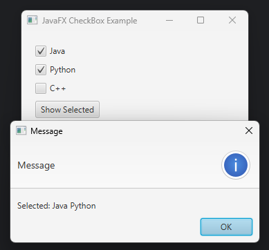

### TextArea

A **TextArea** is a multi-line text input control, suitable for entering or displaying large amounts of text.

**Example:**
```java
package chap03ui;

import javafx.application.Application;
import javafx.scene.Scene;
import javafx.scene.control.*;
import javafx.scene.layout.VBox;
import javafx.stage.Stage;

public class TextAreaDemoFX extends Application {
    @Override
    public void start(Stage stage) {
        TextArea textArea = new TextArea();
        textArea.setPromptText("Enter your comments here...");
        textArea.setPrefRowCount(6);

        Button btn = new Button("Show Text");
        btn.setOnAction(e -> {
            String content = textArea.getText();
            new Alert(Alert.AlertType.INFORMATION, "You entered:\n" + content).showAndWait();
        });

        VBox root = new VBox(10, textArea, btn);
        root.setStyle("-fx-padding: 20;");
        stage.setScene(new Scene(root, 350, 200));
        stage.setTitle("JavaFX TextArea Example");
        stage.show();
    }
    public static void main(String[] args) { launch(args); }
}
```

**Output:**

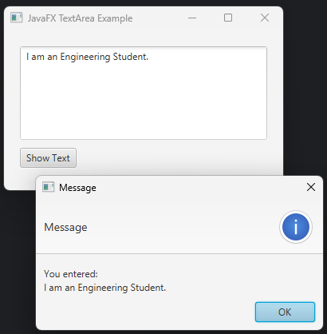

### ComboBox

A **ComboBox** provides a drop-down list of options for users to select from. It can also be made editable to allow custom input.

**Example:**
```java
package chap03ui;

import javafx.application.Application;
import javafx.scene.Scene;
import javafx.scene.control.*;
import javafx.scene.layout.VBox;
import javafx.stage.Stage;

public class ComboBoxDemoFX extends Application {
    @Override
    public void start(Stage stage) {
        ComboBox<String> comboBox = new ComboBox<>();
        comboBox.getItems().addAll("Java", "Python", "C++", "JavaScript");
        comboBox.setPromptText("Select Language");

        Button btn = new Button("Show Selected");
        btn.setOnAction(e -> {
            String selected = comboBox.getValue();
            String msg = (selected != null) ? selected : "None";
            new Alert(Alert.AlertType.INFORMATION, "Selected: " + msg).showAndWait();
        });

        VBox root = new VBox(10, comboBox, btn);
        root.setStyle("-fx-padding: 20;");
        stage.setScene(new Scene(root, 300, 120));
        stage.setTitle("JavaFX ComboBox Example");
        stage.show();
    }
    public static void main(String[] args) { launch(args); }
}
```

**Output:**

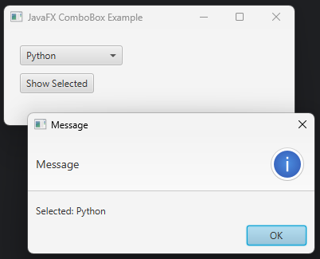


### Summary Table

| Control      | Purpose                                 | Grouping Needed | Multiple Selection | Example Class      |
|--------------|-----------------------------------------|-----------------|-------------------|--------------------|
| RadioButton  | Single choice from a group              | Yes (ToggleGroup)| No                | `RadioButton`      |
| CheckBox     | Multiple independent selections         | No              | Yes               | `CheckBox`         |
| TextArea     | Multi-line text input/display           | No              | N/A               | `TextArea`         |
| ComboBox     | Drop-down list for single selection     | No              | No                | `ComboBox<T>`      |

---
## JavaFX Layouts

JavaFX provides several layout panes to arrange UI controls in a scene. Each layout pane manages the size and position of its child nodes in a specific way. Here are the most commonly used JavaFX layouts, their syntax, and an example:

### 1. HBox

Arranges nodes in a single horizontal row.

**Syntax:**
```java
HBox hbox = new HBox(spacing, node1, node2, ...);
```

### 2. VBox

Arranges nodes in a single vertical column.

**Syntax:**
```java
VBox vbox = new VBox(spacing, node1, node2, ...);
```

### 3. BorderPane

Divides the scene into five regions: top, bottom, left, right, and center.

**Syntax:**
```java
BorderPane borderPane = new BorderPane();
borderPane.setTop(nodeTop);
borderPane.setBottom(nodeBottom);
borderPane.setLeft(nodeLeft);
borderPane.setRight(nodeRight);
borderPane.setCenter(nodeCenter);
```

### 4. GridPane

Arranges nodes in a flexible grid of rows and columns.

**Syntax:**
```java
GridPane grid = new GridPane();
grid.add(node, columnIndex, rowIndex);
```

### 5. FlowPane

Lays out nodes in a flow that wraps at the container’s edge (horizontal or vertical).

**Syntax:**
```java
FlowPane flowPane = new FlowPane(orientation, hgap, vgap, node1, node2, ...);
```

---

### Example: Using Multiple Layouts

```java
package chap03ui;

import javafx.application.Application;
import javafx.scene.Scene;
import javafx.scene.control.*;
import javafx.scene.layout.*;
import javafx.stage.Stage;

public class LayoutDemoFX extends Application {
    @Override
    public void start(Stage stage) {
        // HBox
        HBox hbox = new HBox(10, new Button("HBox 1"), new Button("HBox 2"));

        // VBox
        VBox vbox = new VBox(10, new Label("VBox 1"), new Label("VBox 2"));

        // GridPane
        GridPane grid = new GridPane();
        grid.add(new Label("Row 0, Col 0"), 0, 0);
        grid.add(new Label("Row 0, Col 1"), 1, 0);
        grid.add(new Label("Row 1, Col 0"), 0, 1);
        grid.add(new Label("Row 1, Col 1"), 1, 1);

        // BorderPane
        BorderPane borderPane = new BorderPane();
        borderPane.setTop(hbox);
        borderPane.setLeft(vbox);
        borderPane.setCenter(grid);

        Scene scene = new Scene(borderPane, 400, 250);
        stage.setTitle("JavaFX Layouts Demo");
        stage.setScene(scene);
        stage.show();
    }
    public static void main(String[] args) { launch(args); }
}
```

**Output:**

When you run this program, you will see a window with an HBox at the top, a VBox on the left, and a GridPane in the center, demonstrating the use of multiple JavaFX layouts.

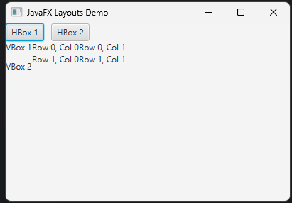


### Summary Table

| Layout Pane | Arrangement         | Typical Use Case                  |
|-------------|---------------------|-----------------------------------|
| HBox        | Horizontal row      | Toolbars, button bars             |
| VBox        | Vertical column     | Forms, stacked controls           |
| BorderPane  | 5 regions           | Main application window structure |
| GridPane    | Grid (rows/columns) | Forms, spreadsheets               |
| FlowPane    | Wrapping flow       | Tag clouds, icon lists            |

---
