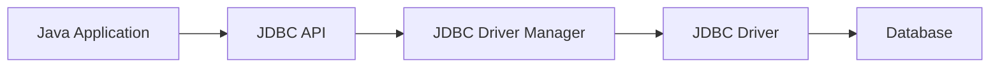

# Chapter 5: Database Connectivity with Java

## Java Database Connectivity
Java Database Connectivity (JDBC) is an API that enables Java applications to interact with relational databases. It provides a standard interface for connecting to databases, executing SQL queries, and retrieving results.

### Key Steps in JDBC

1. **Load the JDBC Driver**  
    The driver acts as a bridge between Java applications and the database.

2. **Establish a Connection**  
    Use `DriverManager` to connect to the database.

3. **Create a Statement**  
    Statements are used to execute SQL queries.

4. **Execute Queries**  
    SQL commands are sent to the database.

5. **Process Results**  
    Results are retrieved using `ResultSet`.

6. **Close Connections**  
    Always close connections to free resources.

### JDBC Architecture Diagram



This architecture allows Java programs to work with different databases in a platform-independent manner.

---

## Types of JDBC Drivers

JDBC drivers are categorized into four types, each with its own architecture and use case:

### 1. Type-1: JDBC-ODBC Bridge Driver

- **Description:** Uses ODBC driver to connect to the database. Acts as a bridge between JDBC and ODBC.
- **Architecture Diagram:**
    ```mermaid
    flowchart LR
        A[Java Application] --> B[JDBC API]
        B --> C[JDBC-ODBC Bridge Driver]
        C --> D[ODBC Driver]
        D --> E[Database]
    ```
- **Example:**  
    ```java
    Class.forName("sun.jdbc.odbc.JdbcOdbcDriver");
    Connection con = DriverManager.getConnection("jdbc:odbc:mydsn", "user", "password");
    ```
- **Note:** Deprecated and not recommended for new applications.

### 2. Type-2: Native-API Driver

- **Description:** Converts JDBC calls into database-specific native calls using client-side libraries.
- **Architecture Diagram:**
    ```mermaid
    flowchart LR
        A[Java Application] --> B[JDBC API]
        B --> C[Native-API Driver]
        C --> D[Native Libraries]
        D --> E[Database]
    ```
- **Example:**  
    ```java
    Class.forName("oracle.jdbc.driver.OracleDriver");
    Connection con = DriverManager.getConnection("jdbc:oracle:oci8:@localhost:1521:xe", "user", "password");
    ```
- **Note:** Requires native database libraries on the client machine.

### 3. Type-3: Network Protocol Driver

- **Description:** Translates JDBC calls into a database-independent network protocol, which is then translated to a DB-specific protocol by a middleware server.
- **Architecture Diagram:**
    ```mermaid
    flowchart LR
        A[Java Application] --> B[JDBC API]
        B --> C[Network Protocol Driver]
        C --> D[Middleware Server]
        D --> E[Database]
    ```
- **Example:**  
    ```java
    Class.forName("com.ddtek.jdbc.sequelink.SequeLinkDriver");
    Connection con = DriverManager.getConnection("jdbc:sequelink://server:port;database=mydb", "user", "password");
    ```
- **Note:** Suitable for internet-based applications.

### 4. Type-4: Thin Driver (Pure Java Driver)

- **Description:** Directly converts JDBC calls to the database-specific protocol using pure Java.
- **Architecture Diagram:**
    ```mermaid
    flowchart LR
        A[Java Application] --> B[JDBC API]
        B --> C[Thin Driver - Pure Java]
        C --> D[Database]
    ```
- **Example:**  
    ```java
    Class.forName("com.mysql.cj.jdbc.Driver");
    Connection con = DriverManager.getConnection("jdbc:mysql://localhost:3306/mydb", "user", "password");
    ```
- **Note:** Platform-independent and widely used in modern applications.

**Summary Table:**

| Type   | Name                    | Platform Dependency | Performance | Example Driver Class                |
|--------|-------------------------|--------------------|-------------|-------------------------------------|
| Type-1 | JDBC-ODBC Bridge        | Yes                | Low         | sun.jdbc.odbc.JdbcOdbcDriver        |
| Type-2 | Native-API              | Yes                | Medium      | oracle.jdbc.driver.OracleDriver     |
| Type-3 | Network Protocol        | No                 | Medium      | com.ddtek.jdbc.sequelink.SequeLinkDriver |
| Type-4 | Thin (Pure Java)        | No                 | High        | com.mysql.cj.jdbc.Driver            |

---

## Example

**InitialSetup.java** (Note that this is only used to setup the initial requirements like a database and table using `java`. You can manually create a tables in database and can access the data.)
```java
package chap05database;

import java.sql.Connection;
import java.sql.DriverManager;
import java.sql.SQLException;
import java.sql.Statement;

public class InitialSetup {

    private static final String URL = "jdbc:mysql://localhost:3306/"; // Connect to MySQL server (no DB yet)
    private static final String USR = "root";                        // Your MySQL username
    private static final String PASSWD = "Your Password";              // Your MySQL password

    /**
     * Creates a new database with the given name.
     * @param dbName Name of the database to create
     */
    public static void createDatabase(String dbName) {

        String sql = "CREATE DATABASE IF NOT EXISTS " + dbName;

        try (Connection conn = DriverManager.getConnection(URL, USR, PASSWD);
             Statement stmt = conn.createStatement()) {
            stmt.executeUpdate(sql);
            System.out.println("Database '" + dbName + "' created successfully!");
        } catch (SQLException e) {
            e.printStackTrace();
        }
    }

    public static Connection getConnection(String dbName) throws SQLException {
        return DriverManager.getConnection(URL + dbName, USR, PASSWD);
    }

    /**
     * Creates the 'users' table if it does not already exist.
     * The table has columns: id (primary key), name, email, password.
     */
    public static void createTable(String dbName, String tableName) {
        String sql = "CREATE TABLE IF NOT EXISTS " + tableName + " (\n" +
                "    id INT PRIMARY KEY,\n" +
                "    name VARCHAR(100),\n" +
                "    email VARCHAR(100),\n" +
                "    password VARCHAR(255)\n" +
                ");\n";
        try (Connection conn = getConnection(dbName);
             Statement stmt = conn.createStatement()) {
            stmt.execute(sql); // Execute the SQL statement to create the table
        } catch (SQLException e) {
            e.printStackTrace(); // Print stack trace if an error occurs
        }
    }

    public static void main(String[] args) {
        createDatabase("db");
        createTable("db", "users");
    }
}
```

**Output:**  ` Database 'db' created successfully!`

**JdbcDemo.java**
```java
package chap05database;

import java.sql.*;

public class JdbcDemo {
    public static void main(String[] args) throws Exception {
        // Load and register the MySQL JDBC driver
        Class.forName("com.mysql.cj.jdbc.Driver");

        // Establish a connection to the database
        // Replace "Your Password" with your actual MySQL root password
        Connection con = DriverManager.getConnection(
                "jdbc:mysql://localhost/db", "root", "Your Password"
        );

        // SQL query with placeholders (?) for values to be inserted
        String query = "INSERT INTO users VALUES(?, ?, ?, ?)";

        // Create a PreparedStatement to safely inject parameters into the query
        PreparedStatement preparedStatement = con.prepareStatement(query);

        // Set the values for each placeholder
        // NOTE: The indices must be unique (1 through 4)
        preparedStatement.setString(1, "101");              // id
        preparedStatement.setString(2, "ABC");              // name
        preparedStatement.setString(3, "abc@gmail.com");    // email
        preparedStatement.setString(4, "ABC");              // password

        // Execute the query (i.e., insert the data)
        preparedStatement.execute();

        // Clean up: close the statement and connection
        preparedStatement.close();
        con.close();

        // Confirmation message
        System.out.println("Data added.");
    }
}
```

**Output:** `Data added.`

**InsertUsers.java** (Note that this is just for adding some data to database for further operations. You can add them manually to databse.)
```java
package chap05database;

import java.sql.Connection;
import java.sql.PreparedStatement;
import java.sql.SQLException;

public class InsertUsers {
    public static void insertUser(String id, String name, String email, String password) {
        String sql = "INSERT INTO users (id, name, email, password) VALUES (?, ?, ?, ?)";
        try (Connection conn = InitialSetup.getConnection("db");
             PreparedStatement preparedStatement = conn.prepareStatement(sql)) {
            preparedStatement.setString(1, id);      // Set user ID
            preparedStatement.setString(2, name);    // Set user name
            preparedStatement.setString(3, email);   // Set user email
            preparedStatement.setString(4, password);// Set user password
            preparedStatement.execute();       // Execute insert statement
        } catch (SQLException e) {
            e.printStackTrace();         // Print stack trace if an error occurs
        }
    }

    public static void main(String[] args) {
        insertUser("102", "BCD", "bcd@gmail.com", "BCD");
        insertUser("103", "CDE", "cde@gmail.com", "CDE");
        insertUser("104", "DEF", "def@gmail.com", "DEF");
        insertUser("105", "EFG", "efg@gmail.com", "EFG");
        insertUser("106", "FGH", "fgh@gmail.com", "FGH");
        insertUser("107", "GHI", "ghi@gmail.com", "GHI");

        System.out.println("Data added successfully!");
    }
}
```

**Output:** `Data added successfully!`

---

## ResultSet

A `ResultSet` in JDBC is an object that holds the data retrieved from a database after executing a SQL query. It functions as a cursor, allowing you to navigate through the rows of the result set one at a time. You can access the values of each column in the current row using getter methods like `getInt()`, `getString()`, and others, either by column name or index. Properly closing the `ResultSet` after use is essential to release database resources and prevent memory leaks.

**In summary:**  
`ResultSet` provides a way to access and process query results row by row, making it a fundamental part of reading data from a database in Java applications.

```java
package chap05database;

import java.sql.*;

public class ResultSetDemo {
    public static void main(String[] args) throws Exception {
        // Load and register the MySQL JDBC driver
        Class.forName("com.mysql.cj.jdbc.Driver");

        // Establish connection to the MySQL database
        // Make sure to replace "Your Password" with your actual MySQL password
        Connection conn = DriverManager.getConnection(
                "jdbc:mysql://localhost/db", "root", "Your Password"
        );

        // SQL query to fetch all rows from the users table
        String sql = "SELECT * FROM users";

        // Create a PreparedStatement to execute the query
        PreparedStatement pre = conn.prepareStatement(sql);

        // Execute the query and get the result set
        ResultSet rs = pre.executeQuery();

        // Print the table header with formatting
        System.out.printf("%-5s %-15s %-25s %-15s\n", "ID", "Name", "Email", "Password");
        System.out.println("---------------------------------------------------------------");

        // Iterate through the result set and print each record in a formatted way
        while (rs.next()) {
            String id = rs.getString("id");
            String name = rs.getString("name");
            String email = rs.getString("email");
            String password = rs.getString("password");

            System.out.printf("%-5s %-15s %-25s %-15s\n", id, name, email, password);
        }

        // Close the ResultSet, PreparedStatement, and Connection
        rs.close();
        pre.close();
        conn.close();
    }
}
```

**Output:**
```output
ID    Name            Email                     Password       
---------------------------------------------------------------
101   ABC             abc@gmail.com             ABC            
102   BCD             bcd@gmail.com             BCD            
103   CDE             cde@gmail.com             CDE            
104   DEF             def@gmail.com             DEF            
105   EFG             efg@gmail.com             EFG            
106   FGH             fgh@gmail.com             FGH            
107   GHI             ghi@gmail.com             GHI  
```

---

## ResultSetMetaData

`ResultSetMetaData` is an interface in JDBC that provides comprehensive information about the columns of a `ResultSet` object. It is especially useful when you need to process SQL query results dynamically, without knowing the structure of the table in advance.

### Key Points

- **Purpose:**  
    `ResultSetMetaData` allows you to retrieve metadata such as the number of columns, column names, data types, sizes, and other properties of each column in a `ResultSet`.

- **Common Methods:**
    - `getColumnCount()`: Returns the number of columns in the `ResultSet`.
    - `getColumnName(int column)`: Returns the name of the specified column.
    - `getColumnType(int column)`: Returns the SQL type of the specified column.
    - `isNullable(int column)`: Indicates whether the column allows `NULL` values.
    - `getColumnDisplaySize(int column)`: Returns the maximum width of the column for display purposes.

- **Usage:**  
    `ResultSetMetaData` is typically obtained by calling the `getMetaData()` method on a `ResultSet` object. This is useful for applications that need to display or process query results in a generic way, such as database browsers or reporting tools.

**In summary:**  
`ResultSetMetaData` provides essential information about the structure of query results, enabling dynamic and flexible handling of database data in Java applications.

### Example

```java
package chap05database;

import java.sql.*;

public class ResultSetMetaDataDemo {
    public static void main(String[] args) throws Exception {
        // Load and register the MySQL JDBC driver
        Class.forName("com.mysql.cj.jdbc.Driver");

        // Connect to the database
        // Replace "Your Password" with the actual MySQL password
        Connection con = DriverManager.getConnection(
                "jdbc:mysql://localhost/db", "root", "Your Password"
        );

        // SQL query to fetch all data from the 'user' table
        String sql = "SELECT * FROM users";

        // Prepare and execute the query
        PreparedStatement pre = con.prepareStatement(sql);
        ResultSet rs = pre.executeQuery();

        // Get metadata from the result set
        ResultSetMetaData rm = rs.getMetaData();
        int count = rm.getColumnCount();

        // Print table name (based on the first column)
        System.out.println("Table Name: " + rm.getTableName(1));
        System.out.println("--------------------------------------------------");

        // Print header
        System.out.printf("%-20s %-20s\n", "Column Name", "Column Type");
        System.out.println("--------------------------------------------------");

        // Print metadata for each column (1-based index)
        for (int i = 1; i <= count; i++) {
            String columnName = rm.getColumnName(i);
            String columnType = rm.getColumnTypeName(i);
            System.out.printf("%-20s %-20s\n", columnName, columnType);
        }

        // Close resources
        rs.close();
        pre.close();
        con.close();
    }
}
```

**Output:**
```output

Table Name: users
--------------------------------------------------
Column Name          Column Type         
--------------------------------------------------
id                   INT                 
name                 VARCHAR             
email                VARCHAR             
password             VARCHAR             
```

---

## Statement vs PreparedStatement

| Feature                | Statement                                      | PreparedStatement                                  |
|------------------------|------------------------------------------------|----------------------------------------------------|
| SQL Syntax             | Accepts static SQL queries                     | Accepts parameterized SQL queries (with `?`)       |
| Compilation            | Compiled every time the query is executed      | Precompiled once, can be executed multiple times   |
| Performance            | Slower for repeated queries                    | Faster for repeated executions                     |
| Security               | Prone to SQL injection if user input is used   | Helps prevent SQL injection                        |
| Parameter Handling     | Manual string concatenation                    | Uses setter methods for parameters                 |
| Code Example           | `Statement stmt = con.createStatement();`      | `PreparedStatement ps = con.prepareStatement(sql);`|
| Use Case               | Simple, one-off queries                        | Repeated or dynamic queries with parameters        |
| Flexibility            | Less flexible for dynamic values               | Highly flexible for dynamic values                 |

**Summary:**  
Use `Statement` for simple, static queries. Use `PreparedStatement` for queries with parameters, repeated execution, or when security is a concern.

---

## RowSet in JDBC

A `RowSet` is an interface in JDBC that extends the capabilities of a `ResultSet` by providing a more flexible and convenient way to handle tabular data from a database. Unlike a standard `ResultSet`, a `RowSet` is a JavaBean component, making it easier to use in GUI applications and to transfer data between different layers of an application.

### Key Features

- **Disconnected Operation:**  
    Some `RowSet` implementations (like `CachedRowSet`) can operate without a continuous connection to the database, allowing data to be fetched, modified, and later synchronized.

- **JavaBean Compliance:**  
    Supports properties, event listeners, and can be serialized, making it suitable for use in JavaBeans-based architectures.

- **Ease of Use:**  
    Provides simpler APIs for common operations such as updating, inserting, and deleting rows.

- **Types of RowSet:**  
    - `JdbcRowSet`: Connected, scrollable, and updatable.
    - `CachedRowSet`: Disconnected, serializable, and can be passed between tiers.
    - `WebRowSet`, `FilteredRowSet`, `JoinRowSet`: Specialized implementations for different use cases.

### Example Usage

```java
package chap05database;

import javax.sql.rowset.CachedRowSet;
import javax.sql.rowset.RowSetProvider;

public class RowSetDemo {
    public static void main(String[] args) throws Exception {
        // Create a CachedRowSet instance using the standard RowSetProvider
        CachedRowSet rowSet = RowSetProvider.newFactory().createCachedRowSet();

        // Set database connection parameters
        rowSet.setUrl("jdbc:mysql://localhost/db");          // Replace 'db' with your database name
        rowSet.setUsername("root");                          // Replace with your username
        rowSet.setPassword("Your Password");                 // Replace with your actual password

        // Set the SQL command to execute
        rowSet.setCommand("SELECT * FROM users");

        // Execute the SQL command and cache the result
        rowSet.execute();

        // Display the result set
        System.out.printf("%-5s %-15s %-25s %-15s\n", "ID", "Name", "Email", "Password");
        System.out.println("---------------------------------------------------------------");

        while (rowSet.next()) {
            String id = rowSet.getString("id");
            String name = rowSet.getString("name");
            String email = rowSet.getString("email");
            String password = rowSet.getString("password");
            System.out.printf("%-5s %-15s %-25s %-15s\n", id, name, email, password);
        }

        // Close the CachedRowSet
        rowSet.close();
    }
}
```

**Output:**
```output
ID    Name            Email                     Password       
---------------------------------------------------------------
101   ABC             abc@gmail.com             ABC            
102   BCD             bcd@gmail.com             BCD            
103   CDE             cde@gmail.com             CDE            
104   DEF             def@gmail.com             DEF            
105   EFG             efg@gmail.com             EFG            
106   FGH             fgh@gmail.com             FGH            
107   GHI             ghi@gmail.com             GHI            
```

**Summary:**  
`RowSet` provides a higher-level, more flexible alternative to `ResultSet`, supporting disconnected operation and JavaBean features, making it useful for modern Java applications.

---