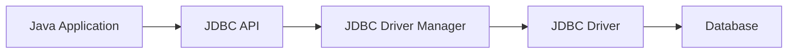

# Chapter 5: Database Connectivity with Java

## Java Database Connectivity
Java Database Connectivity (JDBC) is an API that enables Java applications to interact with relational databases. It provides a standard interface for connecting to databases, executing SQL queries, and retrieving results.

### Key Steps in JDBC

1. **Load the JDBC Driver**  
    The driver acts as a bridge between Java applications and the database.

2. **Establish a Connection**  
    Use `DriverManager` to connect to the database.

3. **Create a Statement**  
    Statements are used to execute SQL queries.

4. **Execute Queries**  
    SQL commands are sent to the database.

5. **Process Results**  
    Results are retrieved using `ResultSet`.

6. **Close Connections**  
    Always close connections to free resources.

### JDBC Architecture Diagram



This architecture allows Java programs to work with different databases in a platform-independent manner.

---

## Types of JDBC Drivers

JDBC drivers are categorized into four types, each with its own architecture and use case:

### 1. Type-1: JDBC-ODBC Bridge Driver

- **Description:** Uses ODBC driver to connect to the database. Acts as a bridge between JDBC and ODBC.
- **Architecture Diagram:**
    ```mermaid
    flowchart LR
        A[Java Application] --> B[JDBC API]
        B --> C[JDBC-ODBC Bridge Driver]
        C --> D[ODBC Driver]
        D --> E[Database]
    ```
- **Example:**  
    ```java
    Class.forName("sun.jdbc.odbc.JdbcOdbcDriver");
    Connection con = DriverManager.getConnection("jdbc:odbc:mydsn", "user", "password");
    ```
- **Note:** Deprecated and not recommended for new applications.

### 2. Type-2: Native-API Driver

- **Description:** Converts JDBC calls into database-specific native calls using client-side libraries.
- **Architecture Diagram:**
    ```mermaid
    flowchart LR
        A[Java Application] --> B[JDBC API]
        B --> C[Native-API Driver]
        C --> D[Native Libraries]
        D --> E[Database]
    ```
- **Example:**  
    ```java
    Class.forName("oracle.jdbc.driver.OracleDriver");
    Connection con = DriverManager.getConnection("jdbc:oracle:oci8:@localhost:1521:xe", "user", "password");
    ```
- **Note:** Requires native database libraries on the client machine.

### 3. Type-3: Network Protocol Driver

- **Description:** Translates JDBC calls into a database-independent network protocol, which is then translated to a DB-specific protocol by a middleware server.
- **Architecture Diagram:**
    ```mermaid
    flowchart LR
        A[Java Application] --> B[JDBC API]
        B --> C[Network Protocol Driver]
        C --> D[Middleware Server]
        D --> E[Database]
    ```
- **Example:**  
    ```java
    Class.forName("com.ddtek.jdbc.sequelink.SequeLinkDriver");
    Connection con = DriverManager.getConnection("jdbc:sequelink://server:port;database=mydb", "user", "password");
    ```
- **Note:** Suitable for internet-based applications.

### 4. Type-4: Thin Driver (Pure Java Driver)

- **Description:** Directly converts JDBC calls to the database-specific protocol using pure Java.
- **Architecture Diagram:**
    ```mermaid
    flowchart LR
        A[Java Application] --> B[JDBC API]
        B --> C[Thin Driver - Pure Java]
        C --> D[Database]
    ```
- **Example:**  
    ```java
    Class.forName("com.mysql.cj.jdbc.Driver");
    Connection con = DriverManager.getConnection("jdbc:mysql://localhost:3306/mydb", "user", "password");
    ```
- **Note:** Platform-independent and widely used in modern applications.

**Summary Table:**

| Type   | Name                    | Platform Dependency | Performance | Example Driver Class                |
|--------|-------------------------|--------------------|-------------|-------------------------------------|
| Type-1 | JDBC-ODBC Bridge        | Yes                | Low         | sun.jdbc.odbc.JdbcOdbcDriver        |
| Type-2 | Native-API              | Yes                | Medium      | oracle.jdbc.driver.OracleDriver     |
| Type-3 | Network Protocol        | No                 | Medium      | com.ddtek.jdbc.sequelink.SequeLinkDriver |
| Type-4 | Thin (Pure Java)        | No                 | High        | com.mysql.cj.jdbc.Driver            |

---

## Example

**InitialSetup.java** (Note that this is only used to setup the initial requirements like a database and table using `java`. You can manually create a tables in database and can access the data.)
```java
package chap05database;

import java.sql.Connection;
import java.sql.DriverManager;
import java.sql.SQLException;
import java.sql.Statement;

public class InitialSetup {

    private static final String URL = "jdbc:mysql://localhost:3306/"; // Connect to MySQL server (no DB yet)
    private static final String USR = "root";                        // Your MySQL username
    private static final String PASSWD = "Your Password";              // Your MySQL password

    /**
     * Creates a new database with the given name.
     * @param dbName Name of the database to create
     */
    public static void createDatabase(String dbName) {

        String sql = "CREATE DATABASE IF NOT EXISTS " + dbName;

        try (Connection conn = DriverManager.getConnection(URL, USR, PASSWD);
             Statement stmt = conn.createStatement()) {
            stmt.executeUpdate(sql);
            System.out.println("Database '" + dbName + "' created successfully!");
        } catch (SQLException e) {
            e.printStackTrace();
        }
    }

    public static Connection getConnection(String dbName) throws SQLException {
        return DriverManager.getConnection(URL + dbName, USR, PASSWD);
    }

    /**
     * Creates the 'users' table if it does not already exist.
     * The table has columns: id (primary key), name, email, password.
     */
    public static void createTable(String dbName, String tableName) {
        String sql = "CREATE TABLE IF NOT EXISTS " + tableName + " (\n" +
                "    id INT PRIMARY KEY,\n" +
                "    name VARCHAR(100),\n" +
                "    email VARCHAR(100),\n" +
                "    password VARCHAR(255)\n" +
                ");\n";
        try (Connection conn = getConnection(dbName);
             Statement stmt = conn.createStatement()) {
            stmt.execute(sql); // Execute the SQL statement to create the table
        } catch (SQLException e) {
            e.printStackTrace(); // Print stack trace if an error occurs
        }
    }

    public static void main(String[] args) {
        createDatabase("db");
        createTable("db", "users");
    }
}
```

**Output:**  ` Database 'db' created successfully!`

**JdbcDemo.java**
```java
package chap05database;

import java.sql.*;

public class JdbcDemo {
    public static void main(String[] args) throws Exception {
        // Load and register the MySQL JDBC driver
        Class.forName("com.mysql.cj.jdbc.Driver");

        // Establish a connection to the database
        // Replace "Your Password" with your actual MySQL root password
        Connection con = DriverManager.getConnection(
                "jdbc:mysql://localhost/db", "root", "Your Password"
        );

        // SQL query with placeholders (?) for values to be inserted
        String query = "INSERT INTO users VALUES(?, ?, ?, ?)";

        // Create a PreparedStatement to safely inject parameters into the query
        PreparedStatement preparedStatement = con.prepareStatement(query);

        // Set the values for each placeholder
        // NOTE: The indices must be unique (1 through 4)
        preparedStatement.setString(1, "101");              // id
        preparedStatement.setString(2, "ABC");              // name
        preparedStatement.setString(3, "abc@gmail.com");    // email
        preparedStatement.setString(4, "ABC");              // password

        // Execute the query (i.e., insert the data)
        preparedStatement.execute();

        // Clean up: close the statement and connection
        preparedStatement.close();
        con.close();

        // Confirmation message
        System.out.println("Data added.");
    }
}
```

**Output:** `Data added.`

---

