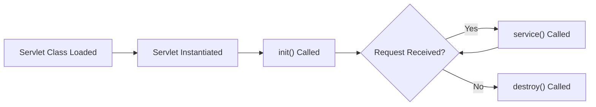

# Chap 06 - Servlets and JSP

## Web Application

A web application is a software program that runs on a web server and is accessed through a web browser over a network such as the Internet or an intranet. Unlike traditional desktop applications, web applications do not require installation on the user's device. They typically use technologies like HTML, CSS, JavaScript for the frontend, and server-side technologies such as Java Servlets, JSP, or frameworks for backend processing. Web applications enable dynamic content, user interaction, and integration with databases and other services, making them essential for modern online services.

---

## Servlets

- Java program to accept request, process it and generate the response.

Servlets are Java classes that extend the capabilities of servers hosting applications accessed via a request-response model. They are commonly used to create dynamic web content and handle HTTP requests and responses. Servlets run on a servlet container (like Apache Tomcat) and provide a robust, scalable, and portable way to build web applications. They support session management, can interact with databases, and are a core component of Java EE web technologies.

### To Create Servlet

- Create a Java class that extends `HttpServlet` present in `jakarta.servlet.http` package.
- Override methods such as `doGet()` or `doPost()` to handle HTTP requests.
- Compile the servlet and place the class file in the appropriate directory of the web application.
- Configure the servlet in `web.xml` or use annotations like `@WebServlet` for mapping URLs.
- Deploy the application to a servlet container (e.g., Tomcat).
- Access the servlet via a web browser using the mapped URL.

### Example

```java
package chap06web;

import jakarta.servlet.annotation.WebServlet;
import jakarta.servlet.http.*;
import jakarta.servlet.*;
import java.io.*;

@WebServlet("/demo")  // This maps the servlet to URL /demo
public class MyServlet extends HttpServlet {

    @Override
    protected void doGet(HttpServletRequest req, HttpServletResponse res) throws ServletException, IOException {
        res.setContentType("text/html"); // Optional, but recommended
        PrintWriter out = res.getWriter();
        out.println("<h1>Hello from MyServlet</h1>");
    }
}
```

### Servlet Life Cycle

The life cycle of a servlet consists of several stages managed by the servlet container:

- **Loading and Instantiation:** The servlet class is loaded and an instance is created.
- **Initialization:** The `init()` method is called once to initialize the servlet.
- **Request Handling:** For each client request, the container calls the `service()` method, which dispatches to `doGet()`, `doPost()`, etc.
- **Destruction:** When the servlet is taken out of service, the `destroy()` method is called for cleanup.



#### Example

```java
package chap06web;

import jakarta.servlet.*;
import jakarta.servlet.http.*;

public class LifeCycleServlet extends HttpServlet{
    public void init(ServletConfig config) {
        System.out.println("Servlet Initialized");
    }

    public void service(HttpServletRequest req, HttpServletResponse res) {
        System.out.println("Service called");
    }

    public void destroy() {
        System.out.println("Destroy called.");
    }
}
```

---