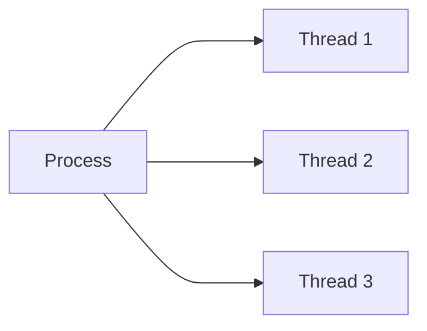

# Chap 7 - Advanced Topics in Java

## Multithreading

Multithreading is a core concept in Java that enables a program to perform multiple tasks simultaneously by running two or more threads concurrently. This approach maximizes CPU utilization and improves application responsiveness, especially in scenarios involving user interfaces, background computations, or I/O operations.

### Key Points

- **Concurrency:** Multiple threads can execute independently within the same process, sharing memory and resources.
- **Efficiency:** Multithreading allows better use of system resources, reducing idle CPU time.
- **Responsiveness:** Applications remain responsive to user input while performing background tasks.
- **Synchronization:** Proper synchronization is essential to avoid issues like race conditions, deadlocks, and data inconsistency.
- **Use Cases:** Commonly used in GUI applications, servers, real-time systems, and any scenario requiring parallel task execution.

### Visualizing Multithreading



### Life Cycle of a Thread

A thread in Java goes through several states during its lifetime:


- **New:** Thread is created but not started.
- **Runnable:** After calling `start()`, the thread is ready to run and waiting for CPU allocation.
- **Running:** The thread is actively executing its `run()` method.
- **Blocked/Waiting:** The thread is temporarily inactive, waiting for resources or another thread's action.
- **Terminated:** The thread has finished execution or has been stopped.

Transitions between these states are managed by the Java Virtual Machine (JVM) and depend on thread scheduling, synchronization, and program logic.

### Creating Threads in Java

There are two common ways to create threads:

#### 1. By Extending the `Thread` Class

```java
class MyThread extends Thread {
    public void run() {
        // Code to execute in the thread
    }
}

MyThread t1 = new MyThread();
t1.start();
```

**Example:**

```java
package chap07advanced;

class HelloThread extends Thread {
    public void run() {
        System.out.println("Hello from a thread!");
    }
    public static void main(String[] args) {
        HelloThread t = new HelloThread();
        t.start();
    }
}
```

**Output:**
```output
Hello from a thread!
```

#### 2. By Implementing the `Runnable` Interface

```java
class MyRunnable implements Runnable {
    public void run() {
        // Code to execute in the thread
    }
}

Thread t1 = new Thread(new MyRunnable());
t1.start();
```

**Example:**

```java
package chap07advanced;

class HelloRunnable implements Runnable {
    public void run() {
        System.out.println("Hello from a runnable thread!");
    }
    public static void main(String[] args) {
        Thread t = new Thread(new HelloRunnable());
        t.start();
    }
}
```

**Output:**
```output
Hello from a runnable thread!
```

#### 3. Using Lambda Expressions (Java 8+)

Lambda expressions provide a concise way to create threads:

```java
Thread t = new Thread(() -> {
    System.out.println("Hello from a lambda thread!");
});
t.start();
```

### Example: Multiple Threads

```java
package chap07advanced;

public class Multithreading implements Runnable {
    Thread t;

    Multithreading() {
        t = new Thread(this);
        t.start();
    }

    @Override
    public void run() {
        for (int i = 0; i < 10; i++) {
            System.out.println("Hello: " + i);
            try {
                Thread.sleep(1000);
            } catch (Exception e) {
                e.printStackTrace();
            }
        }
    }

    public static void main(String[] args) {
        Multithreading obj = new Multithreading();
        Multithreading obj1 = new Multithreading();
    }
}
```

**Output:**
```output
Hello: 0
Hello: 0
Hello: 1
Hello: 1
...
Hello: 9
Hello: 9
```

### Best Practices

- Always use `Thread.sleep()` as a static method: `Thread.sleep(ms);`
- Handle exceptions properly in threads to avoid silent failures.
- Use thread pools (`ExecutorService`) for managing large numbers of threads efficiently.
- Prefer using higher-level concurrency utilities from `java.util.concurrent` package for complex scenarios.

---

## Synchronization

Synchronization ensures that only one thread accesses a shared resource at a time, preventing data inconsistency and race conditions.

- **Thread Safety:** Methods that modify shared data must be synchronized to avoid unpredictable results.
- **Mechanisms:** Use `synchronized` blocks, methods, or higher-level constructs like `ReentrantLock` for thread safety.

**Example of Synchronized Method:**

```java
public synchronized void increment() {
    count++;
}
```

**Example using Synchronized Block:**

```java
public void increment() {
    synchronized(this) {
        count++;
    }
}
```

**Note:** Overusing synchronization can lead to performance bottlenecks and deadlocks. Always synchronize only the necessary code.

### Example

**BankAccount.java**
```java
package chap07advanced.synchronization;

public class BankAccount {
    double balance = 1000;

    public synchronized void withdraw(String name, double amount) {
        if (balance >= amount) {
            System.out.println("Withdraw success by: " + name);
            try {
                Thread.sleep(1000); // Simulate delay
            } catch(Exception e) {
                e.printStackTrace();
            }
            balance -= amount;
        } else {
            System.out.println("Balance not enough.");
        }
    }
}
```

**BankWithdraw.java**
```java
package chap07advanced.synchronization;

public class BankWithdraw extends Thread{
    BankAccount acc;
    String name;
    double amount;

    BankWithdraw(BankAccount acc, double amount, String name) {
        this.acc = acc;
        this.name = name;
        this.amount = amount;
    }

    public void run() {
        acc.withdraw(name, amount);
    }
}
```

**Caller.java:**
```java
package chap07advanced.synchronization;

public class Caller {
    public static void main(String[] args) {
        BankAccount acc = new BankAccount();

        BankWithdraw obj = new BankWithdraw(acc,600, "Ram");
        BankWithdraw obj1 = new BankWithdraw(acc,500, "Hari");

        obj.start();
        obj1.start();
    }
}
```

**Output:**
```output
Withdraw success by: Hari
Balance not enough.
```

---

