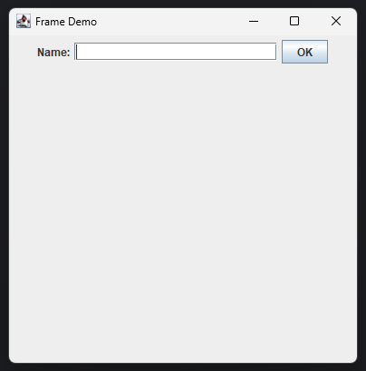
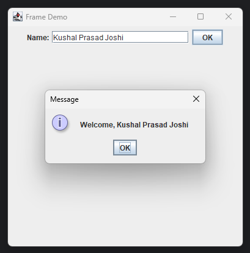

# Lab 06 - Create Frame

## Objective

1. WAP to create the following frame.



---

## Implementation

**Frame.java**
```java
package lab06frame;

import javax.swing.*;
import java.awt.*;
import java.awt.event.*;

public class Frame extends JFrame implements ActionListener {
    // Declare components
    JLabel nameL;
    JTextField nameT;
    JButton okB;

    Frame() {
        // Initialize components
        nameL = new JLabel("Name:");
        nameT = new JTextField(20);
        okB = new JButton("OK");

        // Add ActionListener to `okB` button
        okB.addActionListener(this);

        // Add components
        add(nameL);
        add(nameT);
        add(okB);

        // Define layout
        setLayout(new FlowLayout());
        setSize(400, 400);
        setTitle("Frame Demo");
        setVisible(true);
        setDefaultCloseOperation(EXIT_ON_CLOSE);
    }

    @Override
    public void actionPerformed(ActionEvent e) {
        String name = nameT.getText();
        JOptionPane.showMessageDialog(this, "Welcome, " + name);
    }
}
```

**Main.java**
```java
package lab06frame;

public class Main {
    public static void main(String[] args) {
        new Frame();
    }
}
```

---

## output



---
