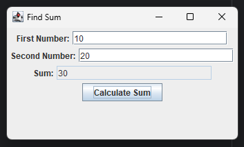

# Lab 07 - Find Sum of Two Given Numbers

## Objective

1. Find the sum of given two numbers by the user through GUI.

---

## Implementation

**FindSum.java**
```java
package lab07sum;

import javax.swing.*;
import java.awt.*;
import java.awt.event.*;

public class FindSum extends JFrame {
    FindSum() {
        // Initialize components
        JLabel number1L = new JLabel("First Number:");
        JLabel number2L = new JLabel("Second Number:");
        JLabel sumL = new JLabel("Sum:");
        JTextField number1T = new JTextField(20);
        JTextField number2T = new JTextField(20);
        JTextField sumT = new JTextField(20);
        sumT.setEditable(false);
        JButton sumButton = new JButton("Calculate Sum");

        // Add components
        add(number1L);
        add(number1T);
        add(number2L);
        add(number2T);
        add(sumL);
        add(sumT);
        add(sumButton);

        // Button action
        sumButton.addActionListener(new ActionListener() {
            public void actionPerformed(ActionEvent e) {
                try {
                    int num1 = Integer.parseInt(number1T.getText());
                    int num2 = Integer.parseInt(number2T.getText());
                    int sum = num1 + num2;
                    sumT.setText(String.valueOf(sum));
                } catch (NumberFormatException ex) {
                    sumT.setText("Invalid input");
                }
            }
        });

        // Define Layout
        setLayout(new FlowLayout());
        setSize(350, 200);
        setTitle("Find Sum");
        setDefaultCloseOperation(EXIT_ON_CLOSE);
        setVisible(true);
    }
}
```

**Main.java**
```java
package lab07sum;

public class Main {
    public static void main(String[] args) {
        new FindSum();
    }
}
```

---

### Ouput



---

