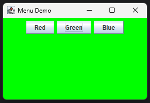

# Lab 08 - Buttons Change Background Color of Frame

## Objective

1. WAP to create a frame with 3 buttons (Red, Green, Blue). When button is pressed change the Background color of frame according to pressed button.

---

### Implementation

**ChangeBackground.java**
```java
package lab08buttons;

import javax.swing.*;
import java.awt.*;

public class ChangeBackground extends JFrame {
    ChangeBackground() {
        // Create components
        JButton red = new JButton("Red");
        JButton green = new JButton("Green");
        JButton blue = new JButton("Blue");

        // Add components
        add(red);
        add(green);
        add(blue);

        // Add ActionListener
        red.addActionListener(e -> getContentPane().setBackground(Color.RED));
        blue.addActionListener(e -> getContentPane().setBackground(Color.BLUE));
        green.addActionListener(e -> getContentPane().setBackground(Color.GREEN));

        // Set the layout
        setLayout(new FlowLayout());
        setSize(300, 200);
        setTitle("Menu Demo");
        setDefaultCloseOperation(EXIT_ON_CLOSE);
        setVisible(true);
    }
}
```

**Main.java**
```java
package lab08buttons;

public class Main {
    public static void main(String[] args) {
        new ChangeBackground();
    }
}
```

---

## Output



---