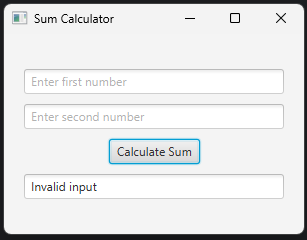
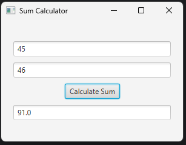

# Lab 09 - Sample JavaFX Program

## Objective

1. WAP to create application with three text fields and one button. When we click on button, show the sumo of frist and second text field to third text field using JavaFX.

---

## Implementation

**SumCalculator.java**
```java
package lab09javafx;

import javafx.scene.control.*;
import javafx.scene.layout.*;
import javafx.scene.Scene;
import javafx.stage.Stage;

public class SumCalculator {
    private TextField num1Field;
    private TextField num2Field;
    private TextField sumField;
    private Button sumButton;

    public VBox getView() {
        num1Field = new TextField();
        num1Field.setPromptText("Enter first number");
        num2Field = new TextField();
        num2Field.setPromptText("Enter second number");
        sumField = new TextField();
        sumField.setPromptText("Sum");
        sumField.setEditable(false);

        sumButton = new Button("Calculate Sum");
        sumButton.setOnAction(e -> {
            try {
                double num1 = Double.parseDouble(num1Field.getText());
                double num2 = Double.parseDouble(num2Field.getText());
                sumField.setText(String.valueOf(num1 + num2));
            } catch (NumberFormatException ex) {
                sumField.setText("Invalid input");
            }
        });

        VBox root = new VBox(10, num1Field, num2Field, sumButton, sumField);
        root.setStyle("-fx-padding: 20; -fx-alignment: center;");
        return root;
    }
}
```


**Main.java**
```java
package lab09javafx;

import javafx.application.Application;
import javafx.scene.Scene;
import javafx.stage.Stage;

public class Main extends Application {
    @Override
    public void start(Stage primaryStage) {
        SumCalculator calculator = new SumCalculator();
        Scene scene = new Scene(calculator.getView(), 300, 200);
        primaryStage.setTitle("Sum Calculator");
        primaryStage.setScene(scene);
        primaryStage.show();
    }

    public static void main(String[] args) {
        launch(args);
    }
}
```

---

## Output

 

---