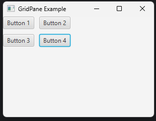

# Lab 10 - GridPane in JavaFX

## Objective

1. WAP to show example of `GridPane` in JavaFX.

---

## Implementation

**GridPaneExample.java**
```java
package lab10gridpane;

import javafx.scene.layout.GridPane;
import javafx.scene.control.Button;

public class GridPaneExample {
    public GridPane createGridPane() {
        GridPane grid = new GridPane();

        Button btn1 = new Button("Button 1");
        Button btn2 = new Button("Button 2");
        Button btn3 = new Button("Button 3");
        Button btn4 = new Button("Button 4");

        grid.add(btn1, 0, 0);
        grid.add(btn2, 1, 0);
        grid.add(btn3, 0, 1);
        grid.add(btn4, 1, 1);

        grid.setHgap(10);
        grid.setVgap(10);

        return grid;
    }
}
```

**Main.java**
```java
package lab10gridpane;

import javafx.application.Application;
import javafx.scene.Scene;
import javafx.stage.Stage;

public class Main extends Application {
    @Override
    public void start(Stage primaryStage) {
        GridPaneExample example = new GridPaneExample();
        Scene scene = new Scene(example.createGridPane(), 300, 200);

        primaryStage.setTitle("GridPane Example");
        primaryStage.setScene(scene);
        primaryStage.show();
    }

    public static void main(String[] args) {
        launch(args);
    }
}
```

---

## Output



---
