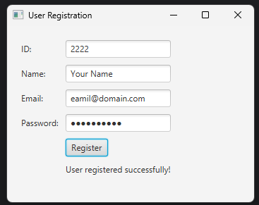
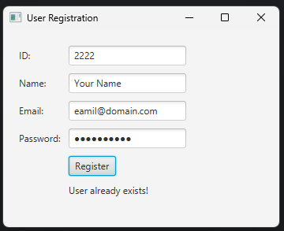

# Lab 15 - GUI to Add Data to Database

## Objective

1. WAP to create a UI using JavaFX which takes `ID`, `Name`, `Email` and `Password` input form the text field:
    - Add the data if not exist to the table `users` in `mydatabase` database.
    - Display "User already exist" if the data already exists in database.

---

## File Structure

- `Main.java` - Entry point of the application.
- `LoginFrame.java` - JavaFX UI for user registration.
- `DatabaseCreator.java` - Helps in creating a new database.
- `DatabaseHelper.java` - Handles database connection and table creation.
- `UserDAO.java` - Handles user-related database operations (insert and  check existence).

---

## Implementation

**Main.java**
```java
package lab15ddbc;

public class Main {
    public static void main(String[] args) {
        // Launch the lab task by calling LoginFrame's main method
        LoginFrame.main(args);
    }
}
```

**LoginFrame.java**
```java
package lab15ddbc;

import javafx.application.Application;
import javafx.geometry.Insets;
import javafx.scene.Scene;
import javafx.scene.control.*;
import javafx.scene.layout.GridPane;
import javafx.stage.Stage;

/**
 * JavaFX UI for user registration.
 * Provides fields for ID, Name, Email, and Password.
 * Handles user registration and displays messages for success or duplicate users.
 */
public class LoginFrame extends Application {
    @Override
    public void start(Stage primaryStage) {
        primaryStage.setTitle("User Registration");

        // Create and configure the layout grid
        GridPane grid = new GridPane();
        grid.setPadding(new Insets(20));
        grid.setVgap(10);
        grid.setHgap(10);

        // ID label and text field
        Label idLabel = new Label("ID:");
        TextField idField = new TextField();
        grid.add(idLabel, 0, 0);
        grid.add(idField, 1, 0);

        // Name label and text field
        Label nameLabel = new Label("Name:");
        TextField nameField = new TextField();
        grid.add(nameLabel, 0, 1);
        grid.add(nameField, 1, 1);

        // Email label and text field
        Label emailLabel = new Label("Email:");
        TextField emailField = new TextField();
        grid.add(emailLabel, 0, 2);
        grid.add(emailField, 1, 2);

        // Password label and password field
        Label passwdLabel = new Label("Password:");
        PasswordField passwdField = new PasswordField();
        grid.add(passwdLabel, 0, 3);
        grid.add(passwdField, 1, 3);

        // Register button
        Button registerButton = new Button("Register");
        grid.add(registerButton, 1, 4);

        // Message label for feedback
        Label messageLabel = new Label();
        grid.add(messageLabel, 1, 5);

        // Event handler for register button using lambda expression
        registerButton.setOnAction(e -> {
            String id = idField.getText();
            String name = nameField.getText();
            String email = emailField.getText();
            String password = passwdField.getText();

            UserDAO userDAO = new UserDAO();
            // Check if user already exists
            if (userDAO.userExists(id)) {
                messageLabel.setText("User already exists!");
            } else {
                // Insert new user and show success message
                userDAO.insertUser(id, name, email, password);
                messageLabel.setText("User registered successfully!");
            }
        });

        // Set up the scene and show the stage
        Scene scene = new Scene(grid, 350, 250);
        primaryStage.setScene(scene);
        primaryStage.show();
    }

    public static void main(String[] args) {
        // Create a database
        DatabaseCreator.createDatabase("mydatabase");
        // Ensure users table exists before launching the UI
        DatabaseHelper.createTable();
        launch(args);
    }
}
```

**DatabaseCreator.java**
```java
package lab15ddbc;

import java.sql.Connection;
import java.sql.DriverManager;
import java.sql.SQLException;
import java.sql.Statement;

public class DatabaseCreator {

    private static final String URL = "jdbc:mysql://localhost:3306/"; // Connect to MySQL server (no DB yet)
    private static final String USR = "root";                        // Your MySQL username
    private static final String PASSWD = "Your Password";              // Your MySQL password

    /**
     * Creates a new database with the given name.
     * @param dbName Name of the database to create
     */
    public static void createDatabase(String dbName) {

        String sql = "CREATE DATABASE IF NOT EXISTS " + dbName;

        try (Connection conn = DriverManager.getConnection(URL, USR, PASSWD);
             Statement stmt = conn.createStatement()) {
            stmt.executeUpdate(sql);
            System.out.println("Database '" + dbName + "' created successfully!");
        } catch (SQLException e) {
            e.printStackTrace();
        }
    }
}
```

**DatabaseHelper.java**
```java
package lab15ddbc;

import java.sql.Connection;
import java.sql.DriverManager;
import java.sql.SQLException;
import java.sql.Statement;

/**
 * Handles database connection and table creation for the user registration.
 */
public class DatabaseHelper {
    // MySQL database URL
    private static final String URL = "jdbc:mysql://localhost/";
    private static final String USR = "root";
    private static final String PASSWD = "Your Password";

    /**
     * Returns a connection to the MySQL database.
     * @return Connection object to the database
     * @throws SQLException if a database access error occurs
     */
    public static Connection getConnection(String dbName) throws SQLException {
        return DriverManager.getConnection(URL + dbName, USR, PASSWD);
    }


    /**
     * Creates the 'users' table if it does not already exist.
     * The table has columns: id (primary key), name, email, password.
     */
    public static void createTable() {
        String sql = "CREATE TABLE IF NOT EXISTS users (\n" +
                "    id INT PRIMARY KEY,\n" +
                "    name VARCHAR(100),\n" +
                "    email VARCHAR(100),\n" +
                "    password VARCHAR(255)\n" +
                ");\n";
        try (Connection conn = getConnection("mydatabase");
             Statement stmt = conn.createStatement()) {
            stmt.execute(sql); // Execute the SQL statement to create the table
        } catch (SQLException e) {
            e.printStackTrace(); // Print stack trace if an error occurs
        }
    }
}
```

---

**UserDAO.java**
```java
package lab15ddbc;

import java.sql.*;

/**
 * Handles user-related database operations such as insert, check existence, and delete.
 */
public class UserDAO {
    /**
     * Inserts a new user into the 'users' table.
     * @param id User ID
     * @param name User name
     * @param email User email
     * @param password User password
     */
    public void insertUser(String id, String name, String email, String password) {
        String sql = "INSERT INTO users (id, name, email, password) VALUES (?, ?, ?, ?)";
        try (Connection conn = DatabaseHelper.getConnection("mydatabase");
             PreparedStatement preparedStatement = conn.prepareStatement(sql)) {
            preparedStatement.setString(1, id);      // Set user ID
            preparedStatement.setString(2, name);    // Set user name
            preparedStatement.setString(3, email);   // Set user email
            preparedStatement.setString(4, password);// Set user password
            preparedStatement.execute();       // Execute insert statement
        } catch (SQLException e) {
            e.printStackTrace();         // Print stack trace if an error occurs
        }
    }

    /**
     * Checks if a user exists in the 'users' table by ID.
     * @param id User ID to check
     * @return true if user exists, false otherwise
     */
    public boolean userExists(String id) {
        String sql = "SELECT id FROM users WHERE id = ?";
        try (Connection conn = DatabaseHelper.getConnection("mydatabase");
             PreparedStatement preparedStatement = conn.prepareStatement(sql)) {
            preparedStatement.setString(1, id);      // Set user ID to check
            ResultSet rs = preparedStatement.executeQuery(); // Execute query
            return rs.next();            // Return true if user exists
        } catch (SQLException e) {
            e.printStackTrace();         // Print stack trace if an error occurs
            return false;
        }
    }
}
```

---

## Output

 

---
