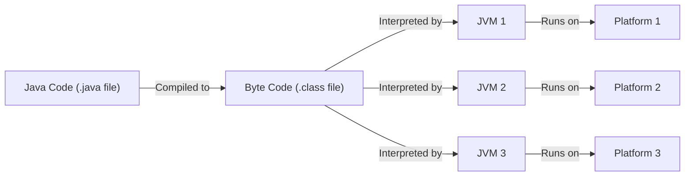
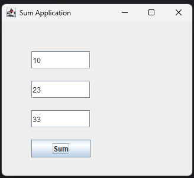

# Term Test I

## Problems

### 1. How Java is Platform Independent. Explain about JVM, JRE and JDK. (5)

Java is platform independent because its source code is compiled into bytecode, which is not specific to any one machine. This bytecode can be executed on any device that has a Java Virtual Machine (JVM). The JVM acts as an interpreter between the bytecode and the underlying operating system, making Java programs portable across different platforms.



- **JVM (Java Virtual Machine):** The JVM is responsible for running Java bytecode on any platform. It provides a runtime environment and handles system-specific operations.
- **JRE (Java Runtime Environment):** The JRE includes the JVM and the libraries needed to run Java applications, but does not include development tools.
- **JDK (Java Development Kit):** The JDK contains the JRE plus development tools like the Java compiler, debugger, and other utilities for developing Java programs.

---

### 2. What is inheritance. Explain with an example. (5)

Inheritance is a fundamental concept in object-oriented programming where a class (called the subclass or child class) acquires the properties and behaviors (fields and methods) of another class (called the superclass or parent class). This allows for code reuse and the creation of hierarchical relationships.

**Example:**

**Animal.java**
```java
package term1.qn2;

class Animal {
    void eat() {
        System.out.println("Animal eats food");
    }
}
```

**Dog.java**
```java
package term1.qn2;

class Dog extends Animal {
    void bark() {
        System.out.println("Dog barks");
    }
}
```

**TestInheritance.java**
```java
package term1.qn2;

public class TestInheritance {
    public static void main(String[] args) {
        Dog d = new Dog();
        d.eat();  // inherited method
        d.bark(); // own method
    }
}
```

In this example, `Dog` inherits the `eat()` method from `Animal`.

**Output:**
```output
Animal eats food
Dog barks
```

---

### 3. Explain exception handling with an example. (5)

Exception handling in Java is a mechanism to handle runtime errors, so the normal flow of the program can be maintained. It uses `try`, `catch`, and `finally` blocks.

**Example:**

```java
package term1.qn3;

public class ExceptionExample {
    public static void main(String[] args) {
        try {
            int a = 10 / 0; // This will throw ArithmeticException
        } catch (ArithmeticException e) {
            System.out.println("Cannot divide by zero: " + e);
        } finally {
            System.out.println("This block always executes.");
        }
    }
}
```

Here, the exception is caught and handled, preventing the program from crashing.

**Output:**
```output
Cannot divide by zero: java.lang.ArithmeticException: / by zero
This block always executes.
```

---

### 4. What is an interface? Create an interface Bank with one method, deposit(). Create a class AbcBank that should inherit from the bank interface. (5)

An interface in Java is a reference type that can contain abstract methods. It is used to achieve abstraction and multiple inheritance.

**Example:**

**Bank.java**
```java
package term1.qn4;

interface Bank {
    void deposit();
}
```

**AbcBank.java**
```java
package term1.qn4;

class AbcBank implements Bank {
    public void deposit() {
        System.out.println("Deposit method implemented in AbcBank");
    }
}
```

**TestBank.java**
```java
package term1.qn4;

public class TestBank {
    public static void main(String[] args) {
        Bank bank = new AbcBank();
        bank.deposit();
    }
}
```

**Output:**
```output
Deposit method implemented in AbcBank
```

---

### 5. WAP to create a swing application with three text fields and 1 button, when the button is clicked, show the sum of the value of first and second text. (10)

```java
package term1.qn5;

import javax.swing.*;
import java.awt.event.*;

public class SumApp {
    public static void main(String[] args) {
        JFrame frame = new JFrame("Sum Application");
        JTextField t1 = new JTextField();
        JTextField t2 = new JTextField();
        JTextField t3 = new JTextField();
        JButton btn = new JButton("Sum");

        t1.setBounds(50, 50, 100, 30);
        t2.setBounds(50, 100, 100, 30);
        t3.setBounds(50, 150, 100, 30);
        btn.setBounds(50, 200, 100, 30);

        btn.addActionListener(new ActionListener() {
            public void actionPerformed(ActionEvent e) {
                int num1 = Integer.parseInt(t1.getText());
                int num2 = Integer.parseInt(t2.getText());
                int sum = num1 + num2;
                t3.setText(String.valueOf(sum));
            }
        });

        frame.add(t1); frame.add(t2); frame.add(t3); frame.add(btn);
        frame.setSize(250, 300);
        frame.setLayout(null);
        frame.setVisible(true);
        frame.setDefaultCloseOperation(JFrame.EXIT_ON_CLOSE);
    }
}
```

**Output:**



---

_The End_